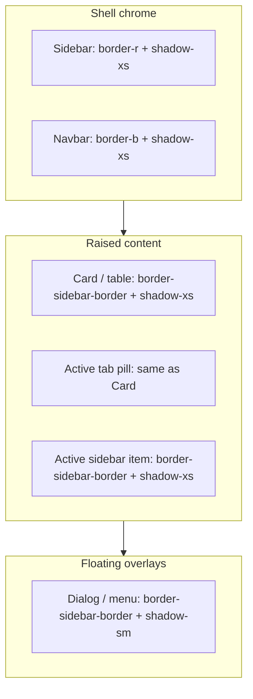

# Design System

This document is the source of truth for UI in this workspace. Read it before
generating any UI. See [`AGENTS.md`](./AGENTS.md) for the enforced rules.

The stack is **Next.js 16 (App Router) + React 19 + TypeScript + Tailwind CSS v4**
with shadcn-style primitives in `src/components/ui/*`. All styling is driven by
**semantic design tokens** so the app can re-theme at runtime.

---

## 1. Theme token architecture

Colors are **never** hardcoded. They are defined as CSS variables and consumed
through Tailwind utilities generated from `@theme inline` in
`src/app/globals.css`.

### How it works

1. Each workspace theme sets a small set of **source tokens** on a
   `[data-theme="…"]` selector (the attribute lives on `<html>` and is managed by
   `next-themes` via `src/components/providers/ThemeProvider.tsx`).
2. A single theme-agnostic `:root` block **bridges** those source tokens to the
   full shadcn token contract (`--card`, `--muted`, `--accent`, `--sidebar`, …).
3. `@theme inline` exposes the tokens as utilities (`bg-surface`,
   `bg-sidebar-active`, `text-foreground`, `border-border`, …).

Because components only read tokens, switching `data-theme` instantly re-themes
the entire app with no re-mount.

### Source tokens (define these per theme)

| Token                  | Purpose                                  |
| ---------------------- | ---------------------------------------- |
| `--background`         | App canvas / outermost background        |
| `--surface`            | Recessed panels, muted areas, inputs     |
| `--surface-elevated`   | Cards, popovers, raised surfaces         |
| `--border`             | All borders, dividers, input outlines    |
| `--text-primary`       | Primary text (bridges to `--foreground`) |
| `--text-secondary`     | Secondary / muted text                   |
| `--primary`            | Brand / accent / active color            |
| `--primary-foreground` | Text/icon on top of `--primary`          |
| `--sidebar-bg`         | Sidebar background                       |
| `--sidebar-active`     | Active nav item background               |
| `--sidebar-hover`      | Hovered nav item background              |
| `--gradient-brand`     | Brand gradient (logo, swatches)          |

### Utilities you should use

`bg-background`, `bg-surface`, `bg-surface-elevated`, `bg-card`, `bg-popover`,
`bg-muted`, `bg-accent`, `bg-primary`, `bg-sidebar`, `bg-sidebar-active`,
`bg-sidebar-hover`, `bg-gradient-brand`, `text-foreground`,
`text-muted-foreground`, `text-primary`, `border-border`, `border-sidebar-border`,
`border-navbar-border`, `ring-ring`, `shadow-xs|sm|md|lg|xl`, `rounded-md|lg|xl`,
`font-sans|display|heading|mono`.

For **raised outer edges** (cards, table shells, tab pills), prefer the shared
helpers in [`src/lib/surface.ts`](src/lib/surface.ts) — see §9.

### Typography faces

| Utility        | Token            | Use for                                         |
| -------------- | ---------------- | ----------------------------------------------- |
| `font-sans`    | `--font-sans`    | Body copy, labels, controls — the default face. |
| `font-display` | `--font-display` | Brand wordmark + page/navbar titles (premium).  |
| `font-mono`    | `--font-mono`    | Code, IDs, tabular/technical values.            |

`font-display` is a modern SaaS display face (Plus Jakarta Sans) wired through
`next/font` to `--font-display`. It is reserved for high-level identity and
title hierarchy (the sidebar brand wordmark, the navbar page title, and the
`PageHeader` page title) so those read as more premium than the surrounding
`font-sans` UI. Navbar titles use `leading-snug` (not `leading-none`) so
descenders on letters like g and y are never clipped in the fixed `h-16` bar.

### Typography hierarchy (5-level scale)

All text falls into one of five levels. Do not invent ad-hoc sizes or weights per
page — import the matching tier from `src/lib/typography.ts` (`typeScale`) or use
the component that already encodes it (`PageHeader`, `SectionHeading`, `CardTitle`,
`CardContainer`, `MetricCard`, `ChartCard`, `DataTable`, `ReportListCard`).

**Weight conventions:** `font-bold` on display page title + brand only;
`font-semibold` on structural headings (L2–L3) and caption overlines (L5);
`font-medium` on body emphasis (active nav, names, labels); `font-normal` on
default body copy.

| Level | Name    | Classes (via `typeScale`)                     | Used by                                                     |
| ----- | ------- | --------------------------------------------- | ----------------------------------------------------------- |
| L1    | Display | `display.page` / `.brand` / `.nav`            | `PageHeader` h1, `SidebarBrand`, `Navbar` title             |
| L2    | Heading | `heading`                                     | `SectionHeading` h2; `SettingsPanel` title (via `CardContainer`) |
| L3    | Title   | `title` / `titleMetric`                       | `CardTitle`, `ChartCard` title; `MetricCard` KPI value      |
| L4    | Body    | `body.default` / `.muted` / `.emphasis`       | Descriptions, nav items, table cells, form labels           |
| L5    | Caption | `caption.overline` / `.meta` / `.tableHeader` | Section labels, KPI labels, eyebrows, emails, table headers |

Face rules: `font-display` is title-only (page, navbar, brand); structural titles
use `font-heading`; everything else is `font-sans`. All secondary copy is
`text-muted-foreground`; never hardcode a grey. Longform copy gets
`leading-relaxed`. Numbers/IDs get `tabular-nums`.

### Available themes

Light (default + 6): `purple-workspace` (default), `arctic-light`, `ocean-cyan`,
`emerald-workspace`, `slate-enterprise`, `rose-quartz`, `amber-executive`.
Dark (3): `midnight-dark`, `graphite-dark`, `neon-cyber`. Metadata (incl. each
theme's `mode`) lives in `src/lib/themes.ts`.

Beyond the surface/text/primary/sidebar source tokens, the `:root` bridge also
exposes status tokens (`--success`, `--warning`, `--info`, `--danger`/
`--destructive`), navbar tokens (`--navbar`, `--navbar-border`), and a
primary-derived `--chart-1..5` ramp — all consumable as utilities
(`bg-success`, `text-warning`, `bg-navbar`, …). Dark themes override the status
palette for contrast.

### Adding a theme

1. Add a `[data-theme="my-theme"] { … }` block with the source tokens in
   `src/app/globals.css`.
2. Add an entry to `WORKSPACE_THEMES` in `src/lib/themes.ts`.

No component changes are required.

---

## 2. Layout system

The application shell is composed of three regions:

```
DashboardLayout
├── Sidebar      (sticky, left, full viewport height)
├── Navbar       (sticky, top of the content column)
└── main         (page content; scrolls with the page)
    └── ContentWrapper (centers + max-width)
        └── PageHeader (owns page padding + spacing; wraps the page)
            ├── header row (title / description / actions)
            └── page content (children)
```

- `src/components/layout/DashboardLayout.tsx` — the shell. Applied once via the
  route-group layout `src/app/(dashboard)/layout.tsx`, so every dashboard page
  inherits it automatically.
- The outer container is `min-h-svh` (no `overflow-hidden`), so the page uses the
  default browser (body) scroll. The sidebar is `sticky top-0 h-svh` and the
  navbar is `sticky top-0`, so both stay pinned while the body scrolls.

### Reusable layout components

| Component        | Responsibility                         |
| ---------------- | -------------------------------------- |
| `Sidebar`        | Fixed sidebar container                |
| `SidebarBrand`   | Prominent product wordmark + mark      |
| `SidebarSection` | Labeled group of nav items             |
| `SidebarItem`    | A single nav link (active/hover/badge) |
| `SidebarFooter`  | Bottom region (settings, profile)      |
| `SidebarProfile` | User profile + sign-out menu           |
| `SidebarNav`     | Pre-composed nav from `nav-config`     |
| `Navbar`         | Sticky top bar (title + account menu)  |
| `UserMenu`       | Avatar-triggered profile dropdown      |
| `ContentWrapper` | Centers content + caps max width       |
| `PageHeader`     | Page wrapper: title/actions + content  |
| `SectionHeading` | Uniform in-page section title + desc   |
| `ThemeSwitcher`  | Runtime theme picker                   |

Navigation is data-driven from `src/components/layout/nav-config.ts`.

---

## 3. Sidebar specifications

- **Width:** `w-60` (15rem). Fixed; full viewport height.
- **Surface:** `bg-sidebar`, right border `border-sidebar-border`, plus `shadow-xs` for soft depth alongside the divider.
- **Structure:** brand (`h-16`) → scrollable nav → footer (settings + profile).
- **Brand (`SidebarBrand`):** a single, prominent text wordmark — no icon mark.
  `font-display text-xl font-bold tracking-tight`: **Asset** in
  `text-foreground`, **360Hub** in `text-primary` (theme brand hue). Brand height
  (`h-16`) matches the navbar so the divider lines align across the two columns.
  Render the wordmark once in the sidebar only; do not duplicate the brand
  elsewhere.
- **Sections:** `typeScale.caption.overline` label (`text-xs font-semibold
tracking-wide uppercase text-muted-foreground`).
- **Item — default:** `font-normal text-muted-foreground`, icon muted, `h-9`,
  `rounded-lg`, `gap-3`. No background pill.
- **Item — hover:** `bg-sidebar-hover`, `text-foreground` (same `font-normal` —
  no weight or size change), icon promoted to `text-foreground`.
  `transition-colors`.
- **Item — active:** `bg-sidebar-active`, `font-medium text-primary`, icon
  `text-primary`, `border-sidebar-border`, optional `shadow-xs`. Active is
  resolved from `usePathname()`.
- **Badges:** use the `Badge` primitive (`variant="secondary"`) for tags like
  `Beta`.
- **Mobile:** below `md`, the sidebar is hidden and opens in a `Sheet`
  (left side) triggered from the navbar.

---

## 4. Navbar specifications

- **Height:** `h-16`. Sticky (`sticky top-0 z-30`).
- **Background:** `bg-navbar/90` with `backdrop-blur-md` (degrades to
  `supports-backdrop-filter:bg-navbar/70`). Adapts per theme, dark mode included.
- **Border:** `border-b border-navbar-border`, plus `shadow-xs` for soft depth below the bar.
- **Title:** the dominant element — `typeScale.display.nav` (`font-display text-lg
sm:text-xl font-semibold tracking-tight text-foreground`), derived from the nav
  config via `getPageTitle`. Uses the same display face as the brand for a
  consistent, premium hierarchy.
- **Content:** title (left), actions + account avatar (right). On mobile it also
  renders the sidebar menu trigger.
- **Account avatar:** opens the `UserMenu` profile dropdown (see §12).
- Stays fixed while the content area scrolls.

---

## 5. Page header specifications

`PageHeader` is the **page wrapper** — it renders the title row _and_ wraps the
page content as `children`. It owns the page padding (`p-4 sm:p-6 lg:p-8`) and
the vertical rhythm between blocks (`space-y-6`). Pages must NOT add their own
outer padding or `gap`/`space-y`/`flex flex-col` wrappers — just pass sections as
children.

```tsx
<PageHeader
  icon={Inbox}
  eyebrow="Welcome back, John Doe"
  title="Intake"
  description="Manage hardware inventory and software licenses in one place."
  actions={<Button>New Intake</Button>}
>
  <CardContainer>…</CardContainer>
  <section>…</section>
</PageHeader>
```

| Prop              | Type               | Notes                                |
| ----------------- | ------------------ | ------------------------------------ |
| `title`           | `string`           | Required.                            |
| `description`     | `string?`          | Secondary copy.                      |
| `eyebrow`         | `React.ReactNode?` | Small label above the title.         |
| `icon`            | `LucideIcon?`      | Rendered in a tokenized badge.       |
| `actions`         | `React.ReactNode?` | Right-aligned buttons.               |
| `children`        | `React.ReactNode?` | Page content, spaced by `space-y-6`. |
| `headerClassName` | `string?`          | Overrides the title/actions row.     |

The title row collapses from a row to a stacked column below `sm`.

**Buttons use the default `size` everywhere.** Do not pass `size="sm"` to page
header actions, toolbar actions, or in-card actions — the default button size is
the workspace standard so controls stay visually consistent across pages. Reserve
the smaller sizes for genuinely dense, specialized UIs only.

### Section headings (`SectionHeading`)

Within a page, group related cards under a `SectionHeading` — never a bare label.
It encodes the section tier of the typography hierarchy (a `font-heading`
`text-lg` `h2` + a muted description + optional right-aligned `actions`) so every
section reads identically across the app. Every section that contains more than
one card should have a title **and** a one-line description.

```tsx
<SectionHeading
  title="Asset Health"
  description="Real-time posture across hardware, software, and mailbox domains."
  actions={<Button>Manage Assets</Button>}
/>
```

---

## 6. Scroll behavior rules

- The page uses the **default browser (body) scroll**. The shell uses `min-h-svh`
  (no `overflow-hidden`); the sidebar (`sticky top-0 h-svh`) and navbar
  (`sticky top-0`) are pinned while the body scrolls.
- The sidebar nav has its own internal `overflow-y-auto` for long nav lists.
- Do not add page-level `min-h-screen`/`h-screen` wrappers — the shell owns
  height. Pages render plain content.

---

## 7. Responsive rules

- **Breakpoints:** Tailwind defaults. `md` (768px) is the desktop/mobile divide
  for the shell.
- `< md`: sidebar collapses into a `Sheet`; navbar shows the menu trigger.
- `>= md`: persistent sidebar; menu trigger hidden.
- Content max width: `1400px`, centered (via `ContentWrapper`). Page padding
  (`p-4 sm:p-6 lg:p-8`) and inter-block spacing (`space-y-6`) are owned by
  `PageHeader`.
- Grids should be mobile-first: e.g. `grid-cols-1 sm:grid-cols-2 xl:grid-cols-4`.

---

## 8. Tab navigation (`TabNav`)

`src/components/ui/tab-nav.tsx` is the **canonical, data-driven tab switcher**.
Use it for every page-level / section-level set of tabs (Overview asset health,
Settings sections, …) so tabs look identical across the app. Never hand-roll a
segmented control or re-style `TabsList`/`TabsTrigger` per page.

- Render it inside a `<Tabs>` root and pair it with `<TabsContent>` panels.
- Items are declarative: `{ value, label, icon?, badge?, disabled? }`.
- `variant="default"` → segmented pill control (the standard). `variant="line"`
  → underlined tabs (use for many sibling sections, e.g. Settings).
- `size="lg"` (default) gives the comfortable page-level height; pass
  `size="default"` for compact inline tabs.

**Elevation (must match §9):** the default variant uses a recessed `bg-muted`
track; the **active pill** lifts with `bg-card`, `border-sidebar-border`, and
`shadow-xs` — same outer edge as cards. `SubTabNav` (report sub-views) uses
standalone pills with the same border token on inactive items. Never swap in
`border-border`, `ring-1`, or heavier shadows on tab shells.

```tsx
<Tabs defaultValue="hardware">
  <TabNav
    items={[
      { value: "hardware", label: "Hardware", icon: HardDrive, badge: "51" },
      { value: "software", label: "Software", icon: AppWindow, badge: "71" },
    ]}
  />
  <TabsContent value="hardware">…</TabsContent>
  <TabsContent value="software">…</TabsContent>
</Tabs>
```

---

## 9. Borders, shadows & surface elevation

This section is the **source of truth for outer edges** — thin outline + soft
lift. Read it before adding borders, rings, or shadows to any new surface.

### Three layers (do not mix them up)

| Layer | Role | Border | Shadow | Examples |
| ----- | ---- | ------ | ------ | -------- |
| **Shell chrome** | Frame the app; sticky sidebar/navbar | Structural edge only: `border-r border-sidebar-border`, `border-b border-navbar-border` | `shadow-xs` | `Sidebar`, `Navbar` |
| **Raised content** | Cards, tables, tab pills sitting on the page | Full box: `border border-sidebar-border` | `shadow-xs` | `Card`, `DataTable` shell, active `TabNav` pill, inactive `SubTabNav` pill |
| **Floating overlays** | Menus, popovers, modal shells above content | Full box: `border border-sidebar-border` | `shadow-sm` | `Dialog`, `AlertDialog`, `Popover`, `DropdownMenu` |



**Stacking at the inner corner:** sidebar is `relative z-20`; navbar is
`sticky z-30` so shadows meet cleanly where the brand row meets the page header.

### Border tokens — which one to use

All three shell-aligned tokens resolve to `--border` per theme in
`src/app/globals.css` (`--sidebar-border`, `--navbar-border`, and `--border`
bridge to the same value). Use the **semantic utility** that matches the surface:

| Utility | When to use |
| ------- | ----------- |
| `border-sidebar-border` | **Outer box** on cards, tables, tab pills, active nav items, popovers, dialogs — anything that should match sidebar/navbar divider weight |
| `border-navbar-border` | **Shell only** — bottom edge of `Navbar` |
| `border-border` | **Internal dividers only** — `border-t` on `CardFooter`, table rows, dialog header strips, section splits inside a surface |

**Do not** use `border-border` on the **outer shell** of a card or panel — it
reads lighter/wrong next to sidebar chrome. **Do not** use `ring-1 ring-foreground/10`
(or any ring) as a card/table outer edge; rings are for focus states and legacy
popover chrome we have migrated away from.

### Shadow tokens — which one to use

Shadows are defined in `:root` via `--shadow-color` and exposed as
`shadow-2xs` … `shadow-2xl`. Stick to the smallest tiers:

| Utility | When to use |
| ------- | ----------- |
| `shadow-xs` | Cards, table shells, empty states, tab pills, sidebar/navbar shell, active sidebar item |
| `shadow-sm` | Dialogs, alert dialogs, popovers, dropdown menus |
| `shadow-md` and up | **Avoid** on dashboard surfaces unless there is a strong reason (e.g. chart tooltip) |

Never pair `shadow-md`/`shadow-lg` with card shells — it fights the minimal
reference look.

### Shared helpers — always prefer these

Import from [`src/lib/surface.ts`](src/lib/surface.ts):

```ts
/** Border color token shared with sidebar/navbar dividers */
shellBorderClassName          // "border-sidebar-border"

/** Raised dashboard surfaces (cards, tables, tab pills) */
surfaceOutlineClassName       // "border border-sidebar-border shadow-xs"

/** Modals and floating panels */
surfaceOverlayClassName       // "border border-sidebar-border shadow-sm"
```

| Helper | Composed classes | Used by |
| ------ | ---------------- | ------- |
| `surfaceOutlineClassName` | `border border-sidebar-border shadow-xs` | `Card` (root shell), `DataTable` shell, requests empty/filter pills |
| `surfaceOverlayClassName` | `border border-sidebar-border shadow-sm` | `DialogContent`, `AlertDialogContent` |
| `shellBorderClassName` | `border-sidebar-border` | Compose manually when you need border color without the full outline |

**Primitives that encode this already** — compose them; do not re-style per page:

- `Card` / `CardContainer` / `MetricCard` / `ChartCard` / `ReportListCard`
- `DataTable` outer shell
- `TabNav` + `TabsTrigger` (default variant active state)
- `SubTabNav` inactive pills
- `Popover`, `DropdownMenu` content
- `SidebarItem` active state (`border-sidebar-border`, `shadow-xs`)

### Surface recipes (copy these)

**Card / KPI / chart panel** — use `Card`; the primitive applies
`surfaceOutlineClassName` automatically:

```tsx
<Card>
  <CardHeader>…</CardHeader>
  <CardContent>…</CardContent>
</Card>
```

**Custom raised box** (only when `Card` is not the right shape):

```tsx
<div className={cn("rounded-xl bg-card", surfaceOutlineClassName)}>…</div>
```

**Table shell** — `DataTable` already wraps rows in `surfaceOutlineClassName`.

**Active sidebar nav item** — built into `SidebarItem`:

```
border border-transparent          → default
data-[active=true]:border-sidebar-border
data-[active=true]:bg-sidebar-active
data-[active=true]:shadow-xs
```

**Shell sidebar / navbar** — keep structural border **and** `shadow-xs`:

```
Sidebar:  border-r border-sidebar-border shadow-xs  (z-20)
Navbar:   border-b border-navbar-border shadow-xs   (z-30)
```

Mobile sheet sidebar: pass `shadow-none` on the nested `Sidebar` (the sheet
edge already separates; see `DashboardLayout`).

### Do / Don't (common mistakes)

| Do | Don't |
| -- | ----- |
| Import `surfaceOutlineClassName` for new raised panels | Hand-roll `border border-border` on card shells |
| Use `border-sidebar-border` for outer boxes | Use `border-border` on card/table/tab outer edges |
| Use `shadow-xs` on content surfaces | Default to `shadow-sm` or `shadow-md` on cards |
| Use `shadow-sm` on dialogs/menus only | Put `shadow-lg` on dashboard cards |
| Keep internal splits as `border-t border-border` | Add `border-t` on `CardActions` (use padding rhythm instead) |
| Extend `Card`, `TabNav`, `DataTable` | Fork per-page bordered wrappers around the same content |
| Match active tab pills to card elevation | Add extra `ring-*` or `border-primary` on standard tabs |

Decorated hero wrappers (e.g. Overview Executive Signals, prompt report executive
summary) may add gradient / primary tint **via `className` on `Card`** — their
extra classes override the base border when needed; do not change the primitive
for one-off marketing chrome.

---

## 10. Cards & panels

This section is the **decision guide for every raised surface** on a dashboard
page. Pick the right primitive first; only fall back to raw `Card` slots for
documented exceptions.

### Which component to use

| Need | Component | Path |
| ---- | --------- | ---- |
| KPI stat (label + value + optional icon / footer slot) | **`MetricCard`** | `src/components/ui/metric-card.tsx` |
| Chart panel (title + description + optional header action) | **`ChartCard`** | `src/components/ui/chart-card.tsx` |
| Standard panel — title, description, body, optional header action / footer CTA | **`CardContainer`** | `src/components/ui/card-container.tsx` |
| Modal / dialog — title, description, scrollable body, footer action row | **`ModalContainer`** | `src/components/ui/modal-container.tsx` |
| Tabular data with column headers, sort, resize, pagination | **`DataTable`** | `src/components/custom/DataTable.tsx` |
| Report result list (icon header + row list + pagination, no columns) | **`ReportListCard`** | `src/app/(dashboard)/reports/_components/shared/report-list-card.tsx` |
| Settings section (title + form + save row) | **`SettingsPanel`** | wraps `CardContainer variant="form"` |
| Decorated one-off hero (gradient / marketing chrome) | Raw **`Card`** + custom body | Overview Executive Signals only |

**Do not** hand-roll `Card` + `CardHeader` + `CardTitle` + `CardContent` on new
pages — use **`CardContainer`** instead. **Do not** hand-roll `Dialog` +
`DialogHeader` + `DialogBody` + `CardActions` on new pages — use
**`ModalContainer`** instead. **Do not** replace `MetricCard`, `ChartCard`, or
`ReportListCard` with `CardContainer`.

```mermaid
flowchart TD
  Q1{KPI / stat tile?}
  Q2{Chart visualization?}
  Q3{Tabular columns + sort?}
  Q4{Report row list?}
  Q5{Form + footer actions?}
  Q6{Decorated hero?}
  MetricCard[MetricCard]
  ChartCard[ChartCard]
  DataTable[DataTable]
  ReportListCard[ReportListCard]
  CardContainer[CardContainer]
  RawCard[Raw Card exception]

  Q1 -->|yes| MetricCard
  Q1 -->|no| Q2
  Q2 -->|yes| ChartCard
  Q2 -->|no| Q3
  Q3 -->|yes| DataTable
  Q3 -->|no| Q4
  Q4 -->|yes| ReportListCard
  Q4 -->|no| Q5
  Q5 -->|yes| CardContainer variant form
  Q5 -->|no| Q6
  Q6 -->|yes| RawCard
  Q6 -->|no| CardContainer display
```

### `CardContainer` (default dashboard panel)

The standard wrapper for lists, tables inside a card, intake forms, filter bars,
settings sections, and read-only panels.

| Prop | Purpose |
| ---- | ------- |
| `title` | Renders `CardTitle` (L3) |
| `description` | Renders `CardDescription` |
| `descriptionClassName` | Extra classes on `CardDescription` (e.g. `max-w-3xl leading-relaxed`) |
| `icon` | Optional `LucideIcon` — accent tile before title, **top-aligned** (`items-start`) |
| `action` | Top-right slot (`CardAction`) — links, buttons, row counts |
| `footer` | Bottom row in `CardActions` |
| `variant="display"` | Default — `CardHeader` + `CardContent`, card `gap-(--card-spacing)` |
| `variant="form"` | `gap-0 py-0` shell; header/body spacing via slot padding; pair with `footer` |
| `formControls` | Applies shared full-width select sizing (`settingsControlClassName`) |
| `onSubmit` | Wraps body + footer in a `<form>` |

```tsx
{/* Display — recent assets table, department template card */}
<CardContainer
  title="Recent Assets"
  description="Latest hardware records onboarded into the tenant."
  action={<Button variant="ghost" asChild><Link href="/hardware">View all</Link></Button>}
>
  <RecentAssetsTable />
</CardContainer>

{/* Form — intake tab, settings panel, list-page filter shell */}
<CardContainer
  variant="form"
  title="Add hardware"
  description="Register a new asset into inventory."
  formControls
  footer={<Button type="submit">Save</Button>}
  onSubmit={handleSubmit}
>
  …fields…
</CardContainer>

{/* Decorated header — Prompt report tab only */}
<CardContainer
  variant="form"
  icon={Sparkles}
  title="Prompt-based report"
  description="…"
  descriptionClassName="max-w-3xl leading-relaxed"
  formControls
  contentClassName="flex flex-col gap-6"
>
  …fields…
</CardContainer>
```

**Nested inset panels** inside a `CardContainer` with a header (e.g. CSV mapping
panel, accordion body): use a **`div`** with `surfaceOutlineClassName` and
`p-(--card-spacing)` — **not** a nested `Card` (nested cards lose top content
padding when a sibling header exists).

**Header-only empty states:** pass `contentClassName="py-16"` with an `Empty`
child; `CardContainer` skips empty `CardContent` when there is no body/footer.

### `ModalContainer` (standard dashboard modal)

Use for every **form, review, or confirmation dialog** on dashboard pages. It is a
thin wrapper around the same structure documented under **Card actions → Dialogs**
below — do not invent a alternate footer strip.

| Prop | Purpose |
| ---- | ------- |
| `open` / `onOpenChange` | Controlled dialog state |
| `title` | Renders `DialogTitle` |
| `description` | Renders `DialogDescription` |
| `footer` | Bottom row rendered in **`CardActions`** (not `DialogFooter`) |
| `size="default"` | `dialogShellClassName` — `sm:max-w-md` |
| `size="wide"` | `dialogShellClassNameWide` — `sm:max-w-2xl` |
| `size="xl"` | `dialogShellClassNameXl` — `sm:max-w-4xl` |
| `contentClassName` | Custom shell classes — e.g. `sm:max-w-3xl` when presets are not enough |
| `formControls` | Applies shared full-width select sizing (`settingsControlClassName`) |
| `onSubmit` | Wraps body + footer in a `<form>` |
| `bodyClassName` / `footerClassName` | Extra classes on body / footer rows |

```tsx
{/* Form modal — matches Add supplier / Register software dialogs */}
<ModalContainer
  open={open}
  onOpenChange={setOpen}
  title="Add supplier"
  description="Vendor details and contact info."
  formControls
  onSubmit={handleSubmit}
  footer={
    <>
      <DialogClose asChild><Button variant="outline">Cancel</Button></DialogClose>
      <Button type="submit">Add supplier</Button>
    </>
  }
>
  <FieldGroup>…fields…</FieldGroup>
</ModalContainer>
```

**Structure** (implemented in `src/components/ui/modal-container.tsx`):

| Region | Primitive / classes |
| ------ | ------------------- |
| Shell | `DialogContent` + `dialogShellClassName` — `bg-card p-0 gap-0`, `[--dialog-chrome:10rem]` |
| Header | `DialogHeader` + `dialogHeaderClassName` — `border-b border-border px-4 py-4 pr-12` |
| Body | `DialogBody` + `dialogFormBodyClassName` — scrollable, `px-4 py-4` (same as supplier add/edit) |
| Footer | **`CardActions`** — `p-5` inset (`p-4` when `Card size="sm"`), `bg-card`, no `border-t`, right-aligned buttons |

**Do not** use `DialogFooter` (muted strip) for submit rows. **Do not** add
`bg-muted/50` or `border-t` on dialog action rows — that diverges from the card
surface pattern.

**Lazy mount on pages with multiple modals:** do not keep every dialog in the tree
while closed. Gate each modal with page-level `open` state and render only when
needed. Optional: `next/dynamic` only when the modal chunk is very heavy.

```tsx
{addRequestOpen ? (
  <AddRequestDialog open={addRequestOpen} onOpenChange={setAddRequestOpen} … />
) : null}

{reviewOpen && selectedItem ? (
  <ReviewDialog open={reviewOpen} onOpenChange={setReviewOpen} item={selectedItem} … />
) : null}
```

Keep fetch / form reset logic inside the modal and keyed off `open` (or rely on
unmount to reset local state). Inline dialogs on a single-action page (e.g. one
Add supplier modal) may stay mounted; apply lazy mount when a page owns **several**
modals or API-backed flows.

**View filters** (Pending / All with counts): use **`TabNav`** with `size="default"`
inside a `<Tabs>` root — pass counts via the `badge` prop, not `(n)` in the label.
Do not hand-roll segmented filter pills.

### `MetricCard`

Use for **numeric KPI tiles** only — overview stats, report KPI rows, page header
metric grids. Pass `iconVariant="badge"` for the accent icon tile (overview /
inventory pages). Optional `children` for mini breakdowns; optional `footer` for
supplementary copy (no top divider — built into the primitive).

Do **not** use `MetricCard` where you need a title + free-form panel body — use
`CardContainer`.

### `ChartCard`

Use for **Recharts / chart panels** with a standard chart header (title,
description, optional `action` for legends or context badges). Do not fork
chart wrappers per page.

### `DataTable`

Use when rows need **column headers**, sorting, optional column resize, and the
shared pagination footer. Inventory pages (hardware, software, employees, …)
compose `DataTable` inside `CardContainer` (filter bar in the card body, table
below).

Pagination footer pattern: `border-t border-border bg-muted/30 px-4 py-3`, text
Previous/Next links, bordered page indicator — see `DataTable` implementation.

### `ReportListCard` (reports only)

A **list-shaped report panel** — not a columnar table. Used on hardware /
software / certifications report tabs below the KPI grid.

Characteristics:

- **Custom header** (not `CardContainer`) — icon tile + `typeScale.title` +
  caption meta + row count; required because reports use a decorated icon lockup.
- Shell: `Card` with `gap-0 overflow-hidden py-0`; inner wrapper is a plain
  **`div`**, not `CardContent` (avoids phantom top padding when no `CardHeader`).
- **Header band:** `px-(--card-spacing) py-5`, `border-b border-border`, flex row
  with `sm:items-center` (row count vertically centered against title block).
- **List rows:** `px-(--card-spacing) py-3`, `items-center`, `divide-y divide-border`.
- **Footer band:** `px-(--card-spacing) py-3`, `border-t border-border` — same
  horizontal inset as header; pagination matches `DataTable` controls.
- **Status pills:** `ReportStatusBadge` (`report-status-badge.tsx`) — semantic
  variants (`success`, `info`, `warning`, `destructive`, …), not generic
  `secondary` for every state. Map status in report data mappers
  (`src/lib/reports/*`).

```tsx
<ReportListCard
  title={reportData.config.title}
  description={reportData.config.description}
  generatedOn={reportData.generatedOn}
  rows={reportData.rows}
/>
```

Report filter bars use **`CardContainer`** with `formControls` (no title — body
only with an overline label inside). Report “coming soon” placeholders use
`CardContainer` with centered `Empty`.

### Raw `Card` exceptions

| Case | Pattern |
| ---- | ------- |
| Executive Signals hero (Overview) | `Card` + `CardContent`, gradient override |
| Prompt report executive summary | Decorated `Card`, gradient tint |
| `ReportListCard` | Custom header/footer bands (see above) |
| Auth forms | `AuthPageShell` / auth-specific layout |

Everywhere else → **`CardContainer`**, **`ModalContainer`**, **`MetricCard`**, **`ChartCard`**, or
**`DataTable`**.

### Card padding (slot rules)

`Card` owns horizontal rhythm via `--card-spacing` (default `--spacing(5)` ≈ 20px;
`size="sm"` ≈ 16px). **Vertical inset lives on the slots**, not on the card shell —
do not rely on ad-hoc `py-*` on the root `Card` for everyday display cards.

| Slot                         | Padding                                                                                           |
| ---------------------------- | ------------------------------------------------------------------------------------------------- |
| `CardHeader`                 | `px-(--card-spacing) pt-(--card-spacing)`                                                         |
| `CardContent`                | `px-(--card-spacing) pb-(--card-spacing)`; adds `pt-(--card-spacing)` when there is **no** header; **`pb-0`** when `CardActions` follows (use `settingsCardContentWithActionsClassName` if overriding padding) |
| `CardActions` / `CardFooter` | `p-5` on actions (`p-4` when `Card size="sm"`); `CardFooter` uses `p-(--card-spacing)` |

The root `Card` keeps `gap-(--card-spacing)` between slots. Use that default gap for
`CardHeader` + `CardContent` display cards (department templates, chart panels, …).

### When to use `gap-0 py-0` on the shell

Reserve `className="gap-0 py-0"` for **scroll + actions** or **single-region** cards
only:

```tsx
<Card className="gap-0 py-0">
  <CardContent className="max-h-[min(52vh,22rem)] overflow-y-auto p-(--card-spacing)">
    …fields or lists…
  </CardContent>
  <CardActions>
    <Button variant="outline">Cancel</Button>
    <Button type="submit">Save</Button>
  </CardActions>
</Card>
```

**Do not** pair `gap-0 py-0` with bare `CardHeader` + `CardContent` — those slots
only apply horizontal padding unless you also supply full `p-(--card-spacing)` on
each region. That mismatch is what causes content flush to the card edges.

For multi-column card grids, add `items-start` so cards stay content-height instead
of stretching with empty space at the bottom.

**Vertical rhythm reference:** header bands that need the full card inset use
`py-5` (20px, same as `--card-spacing`). Report list header uses
`px-(--card-spacing) py-5`; footer uses `px-(--card-spacing) py-3`.

Do not add ad-hoc `p-*` overrides to align cards — adjust `size`, compose with
`--card-spacing`, or use the documented band classes instead.

### Card actions (primary pattern)

Use `CardActions` for every form / panel / dialog footer that lives on a card
surface. Actions belong **on the card**, not on `DialogFooter` (muted strip) or
floating outside the card.

- `CardActions` is a sibling of `CardContent` inside `Card` (`gap-0 py-0` on the
  card shell).
- **No** `border-t` on `CardActions` — spacing comes from `CardContent` bottom
  inset (`pb-0` when actions follow) plus `p-(--card-spacing)` on the action row.
- Layout: `flex justify-end gap-2` with `p-(--card-spacing)`.
- **Buttons:** use the default `Button` size (no `size="lg"`, `size="sm"`, or ad-hoc
  `h-*` / `px-*` on save rows). Same rule as page header and intake form footers.
- Long card bodies scroll in `CardContent`; actions stay pinned below the scroll
  region via `CardActions`.

**Dialogs:** use a single **`bg-card` dialog shell** — do not nest an inset
`Card` with margins inside `DialogContent` (`bg-popover`). Structure:

```tsx
<DialogContent className="flex max-h-[calc(100vh-2.5rem)] flex-col gap-0 overflow-hidden bg-card p-0 text-card-foreground [--dialog-chrome:10rem] sm:max-w-md">
  <DialogHeader className="shrink-0 border-b border-border px-4 py-4 pr-12">…</DialogHeader>
  <DialogBody className="min-h-0 overflow-y-auto max-h-[calc(100vh-2.5rem-var(--dialog-chrome))] px-4 py-4">
    …fields or lists…
  </DialogBody>
  <CardActions>…</CardActions>
</DialogContent>
```

Use **`max-h-[calc(100vh-2.5rem-var(--dialog-chrome))] overflow-y-auto`** on `DialogBody` so height
follows content until the shell cap; then the body scrolls. Do **not** set a fixed `h-[…]` on the shell —
only `max-h-[calc(100vh-2.5rem)]`.
`max-h` alone is not reliable inside flex dialogs. `CardActions` must include
`bg-card` (built into the primitive) so the action row matches the card surface.
Overlay: `bg-black/45` (`bg-black/35` when backdrop-filter is supported) +
`backdrop-blur-sm` (shared `modalOverlayClassName` on dialogs, sheets, and alert
dialogs).

**Do not** use `DialogFooter` for form submit rows when the content is already
card-based. `CardFooter` is for muted summary chrome only, not primary actions.

---

## 11. Reusable component rules

- Prefer primitives in `src/components/ui/*`; never duplicate them.
- **Cards:** follow §10 — `CardContainer` for panels, `ModalContainer` for dialogs,
  `MetricCard` / `ChartCard` /
  `ReportListCard` / `DataTable` for their specialized shapes; do not fork
  `Card` + `CardTitle` + `CardContent` per page.
- Global layout (`Sidebar`, `Navbar`, `DashboardLayout`) is shared — extend, do
  not fork per page.
- Keep Server Components the default; add `"use client"` only where interactivity
  (state, effects, browser APIs, context) is required. Layout/sidebar/navbar are
  client because they use `usePathname`/state; pages stay server when possible.
- New shared building blocks belong in `src/components/layout` (shell-level) or
  `src/components/ui` (primitives) — not inline in pages.

---

## 12. Profile menu specifications

The navbar avatar opens `UserMenu` — the canonical account experience. It is
built on the shared `DropdownMenu` primitive, so it inherits open/close
animation, click-outside + `Escape` dismissal, roving keyboard focus, and theme
awareness with no extra work. Never hand-roll popover/outside-click logic.

Structure (token-driven, `w-72`):

- **Header:** organization name (`text-xs uppercase text-muted-foreground`) +
  a `Sign out` action (`text-primary`).
- **Identity:** `lg` avatar, full name (`text-sm font-semibold`), and email
  (`text-xs text-muted-foreground`).
- **Footer:** shortcut rows — `Settings` (`/settings`) and `Theme preferences`
  (`/settings#theme`).

Pass `user` (`{ name, email, avatarUrl?, organization? }`) and `onSignOut` down
from `DashboardLayout`. To add a shortcut, add another row in the footer group;
do not create a parallel menu.
